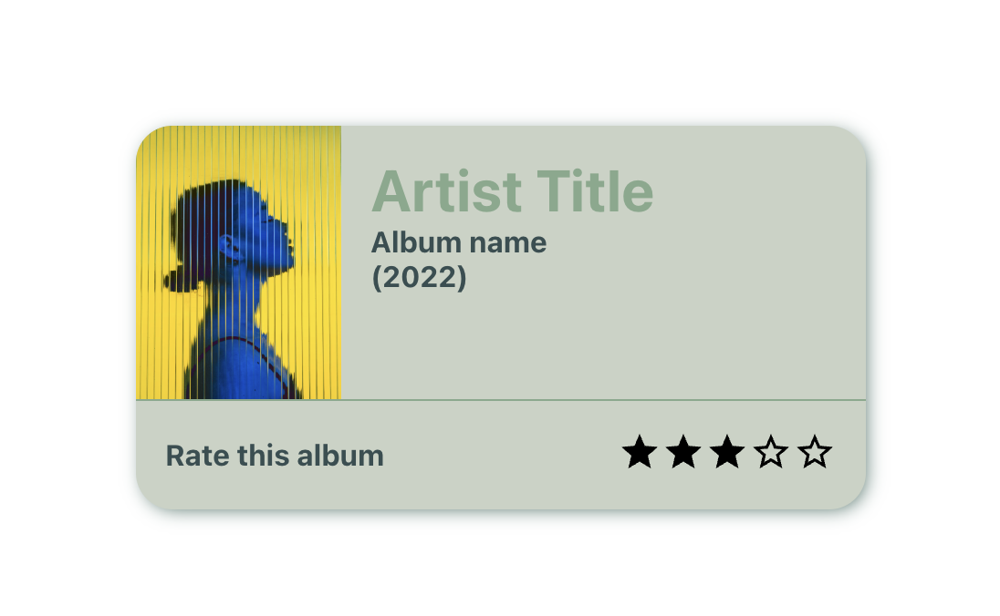

# Screenshot

## Styled Component

J'ai utilisé **Styled Component** puisque l'enquête state of CSS semblait indiquer une tendance à la hausse de cette librairie. Je l'ai également choisie car je ne l'avais jamais utilisée auparavant contrairement à émotion via MUI. J'ai utilisé les icones MUI que je trouvais plus simple d'utilisation.
